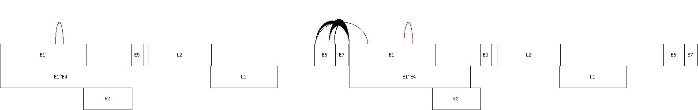

# vircircRNA

De novo circular RNA detection from circular viral genome


## Requirements

1. Bash (/bin/bash) in Linux or Mac OS
2. Perl - https://www.perl.org
3. BWA - http://bio-bwa.sourceforge.net
4. SAMtools - http://www.htslib.org (optional) to reduce disk usage by excluding unmapped reads from SAM file
5. Perl module "GD" and "GD::Text::Align" - https://metacpan.org/pod/GD and https://metacpan.org/pod/GD::Text::Align (optional) to draw diagram


## Install

If you already have Git (https://git-scm.com) installed, you can get the latest development version using Git.
```
git clone https://github.com/jiwoongbio/vircircRNA.git
```


## Usages

```
./vircircRNA.sh <circular_chromosome.fasta> <gene.gff> <output.prefix> <input.1.fastq> [input.2.fastq]
```

* Demo
```
./vircircRNA.sh NC_001526.4.fasta NC_001526.4.gff3 SRS2410540 SRS2410540.part.1.fastq.gz SRS2410540.part.2.fastq.gz
```



## Usages (step-by-step)

1. Generate concatenated sequence of circular chromosome
```
perl vircircRNA_chromosome.pl <circular_chromosome.fasta> > <concatenated_circular_chromosome.fasta>
```

2. Mapping reads to concatenated sequence of circular chromosome
```
bwa index <concatenated_circular_chromosome.fasta>
bwa mem -T 19 -Y <concatenated_circular_chromosome.fasta> <input.1.fastq> [input.2.fastq] > <mapped_read.sam>
```

3. Back-splice junction identification
```
perl vircircRNA_junction.pl -g <gene.gff> -A <junction.alignment.html> <mapped_read.sam> <concatenated_circular_chromosome.fasta> > <junction.txt>
```

4. Draw diagram
```
perl vircircRNA_diagram.pl -g <gene.gff> <junction.txt> <concatenated_circular_chromosome.fasta> <chromosome> > <diagram.png>
```
